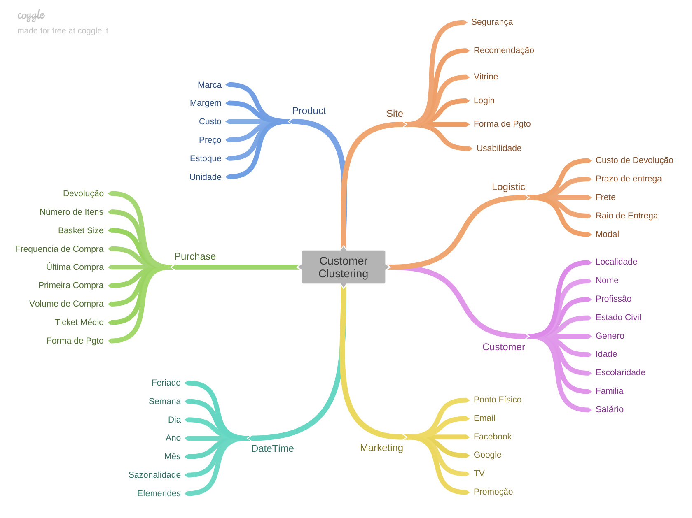

# Insiders Loyalty Program

### Unsupervised Learning - Clustering Project

## 1. Abstract

This repository contains the solution of clustering valuable clients in order to launch a loyalty program called Insiders

**Keywords:** Python, Pandas

## 2. Methodology

The CRISP-DM methodology was the guide for this data science project development. 

CRISP-DM, which stands for Cross-Industry Standard Process for Data Mining, is an industry-proven way to guide your data mining efforts and it includes descriptions of the typical phases of a project, the tasks involved with each phase, and an explanation of the relationships between these tasks.

**Source:* [IBM Docs](https://www.ibm.com/docs/en/spss-modeler/18.2.0?topic=dm-crisp-help-overview)

To direct your reading, below are links to the development carried out at each stage of the CRISP cycle:

* [Business Understanding](https://github.com/vitorhmf/loyalty-program#3-business-understanding)
* [Data Understanding](https://github.com/vitorhmf/loyalty-program#4-data-understanding)
* [Data Preparation](https://github.com/vitorhmf/loyalty-program#5-data-preparation)
* [Machine Learning Modeling](https://github.com/vitorhmf/loyalty-program#6-machine-learning-modeling)
* [Evaluation](https://github.com/vitorhmf/loyalty-program#7-evaluation)
* [Depoyment](https://github.com/vitorhmf/loyalty-program#8-deployment)

## 3. Business Understanding

### 3.1. Context

| Feature                | Definition                                                                                               |
|------------------------|----------------------------------------------------------------------------------------------------------|
| Invoice Number         | Unique identifier for each transaction                                                                   |
| Stock Code Product     | Item code                                                                                                |
| Description Product    | Item name                                                                                                |
| Quantity               | The quantity of each item purchased per transaction                                                      |
| Invoice Date           | The day the transaction took place                                                                       |
| Unit Price             | Product price per unit                                                                                   |
| Customer ID            | Unique customer identifier                                                                               |
| Country                | The name of the country the customer resides in                                                          |

### 3.2. Business assumption: 

[Back to the top](https://github.com/vitorhmf/loyalty-program#2-methodology)

## 4. Data Understanding

### 4.1. Data Cleaning

To build an overview of the data, the following steps were performed:
* Change the columns name to sneak_case;
* Shows the data dimensions (rows and columns);
* Check and Fillout NA: the dataset did not have any missing values;

### 4.2 Data Descriptive: 

A quick descriptive analysis of numerical and categorical variables was performed.
 
**Numerical Attributes:**

**Categorical Attributes:**

 
### 4.3. Feature Engineering

Before performing the feature engineering, a mental map was created to evaluate the relationship between the sales phenomenon and the agents that act on it, as well as the attributes of each agent.

From this mental map, business hypotheses were created in order to develop the understanding of the case and raise new variables that are important to derive from the original dataset for the creation of the machine learning model.
 
In this step, the following features were created:
* Vehicle Age: changed to snake case;
* Vehicle Damage: changed to 1 (yes) or 0 (no);

### 4.4. Data Filtering

In this project, it was not necessary to apply any type of filter to the dataset

### 4.5. Exploratory Data Analysis

In the data exploration, univariate, bivariate and multivariate analyzes were performed. Of the business insights obtained in this phase, 3 stood out for presenting different results than expected:

[Back to the top](https://github.com/vitorhmf/loyalty-program#2-methodology)

## 5. Data Preparation

### 5.1 Feature Transformation

### 5.2 Feature Selection: 

The feature selection was performed using the extra trees classifier algorithm

[Back to the top](https://github.com/vitorhmf/loyalty-program#2-methodology)

## 6. Machine Learning Modeling

[Back to the top](https://github.com/vitorhmf/loyalty-program#2-methodology)

## 7. Evaluation

[Back to the top](https://github.com/vitorhmf/loyalty-program#2-methodology)

## 8. Deployment

[Back to the top](https://github.com/vitorhmf/loyalty-program#2-methodology)

## 9. Conclusion

### 9.1. Business Results

### 9.2. Next Steps

[Back to the top](https://github.com/vitorhmf/loyalty-program#2-methodology)

## 10. References

* [IBM Docs](https://www.ibm.com/docs/en/spss-modeler/18.2.0?topic=dm-crisp-help-overview)
* [Kaggle](https://www.kaggle.com/datasets/anmolkumar/health-insurance-cross-sell-prediction)
* [Comunidade DS](https://www.comunidadedatascience.com/)

[Back to the top](https://github.com/vitorhmf/loyalty-program#2-methodology)

