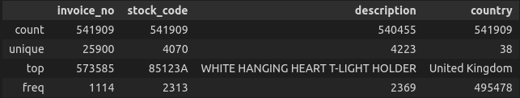
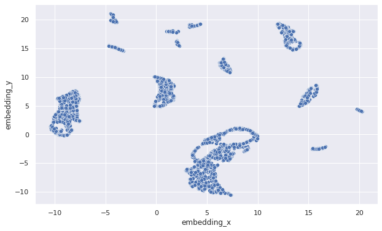
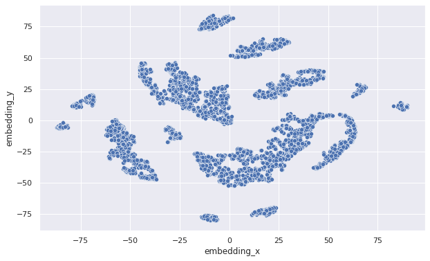

# Insiders Loyalty Program (Under Development)

### Unsupervised Learning - Clustering Project

## 1. Abstract

The company All in One Place is a Multibrand Outlet that sells second-line products from various brands at a lower price, through an e-commerce. After 1 year of business operations, the marketing team decided to launch a loyalty program for the best customers in the base, called Insiders. 

This **clustering project** was carried out from a dataset with 4,373 customers and 541,909 records of purchases made between December 2010 and December 2011. 

The final result of the algorithm selected 162 people for the Insiders cluster. They are 3.7% of the base's customers, which represent 37% of the company's total revenue. 

All the details of each cluster formed are presented in a dashboard that can be accessed through this link.

**Keywords:** Python, Pandas

## 2. Methodology

The CRISP-DM methodology was the guide for this data science project development. 

CRISP-DM, which stands for Cross-Industry Standard Process for Data Mining, is an industry-proven way to guide your data mining efforts and it includes descriptions of the typical phases of a project, the tasks involved with each phase, and an explanation of the relationships between these tasks.

**Source:* [IBM Docs](https://www.ibm.com/docs/en/spss-modeler/18.2.0?topic=dm-crisp-help-overview)

To direct your reading, below are links to the development carried out at each stage of the CRISP cycle:

* [Business Understanding](https://github.com/vitorhmf/loyalty-program#3-business-understanding)
* [Data Understanding](https://github.com/vitorhmf/loyalty-program#4-data-understanding)
* [Data Preparation](https://github.com/vitorhmf/loyalty-program#5-data-preparation)
* [Machine Learning Modeling](https://github.com/vitorhmf/loyalty-program#6-machine-learning-modeling)
* [Evaluation](https://github.com/vitorhmf/loyalty-program#7-evaluation)
* [Depoyment](https://github.com/vitorhmf/loyalty-program#8-deployment)

## 3. Business Understanding

### 3.1. Context

The company All in One Place is a Multibrand Outlet that sells second-line products from various brands at a lower price, through an e-commerce.

In just over 1 years of operation, the business team realized that some customers from its base buy more expensive products, with high frequency and end up contributing a significant portion of the company's revenue. Based on this perception, the marketing team decided to launch a loyalty program for the best customers in the base, called Insiders.

This project aims to solve the demand to carry out a selection of customers eligible for the Insiders program, using advanced data manipulation techniques.

The clustering will be performed from a dataset with 541,909 purchase records, 4,373 customers and carried out between December 2010 and December 2011. The attributes are described below:

| Feature                | Definition                                                                                               |
|------------------------|----------------------------------------------------------------------------------------------------------|
| Invoice Number         | Unique identifier for each transaction                                                                   |
| Stock Code Product     | Item code                                                                                                |
| Description Product    | Item name                                                                                                |
| Quantity               | The quantity of each item purchased per transaction                                                      |
| Invoice Date           | The day the transaction took place                                                                       |
| Unit Price             | Product price per unit                                                                                   |
| Customer ID            | Unique customer identifier                                                                               |
| Country                | The name of the country the customer resides in                                                          |

*Source:* [Kaggle](https://www.kaggle.com/datasets/carrie1/ecommerce-data)

### 3.2. Business assumption:

Only records with values above $0.04 were considered valid for analysis.

[Back to the top](https://github.com/vitorhmf/loyalty-program#2-methodology)

## 4. Data Understanding

### 4.1. Data Cleaning

To build an overview of the data, the following steps were performed:
* Change the columns name to sneak_case;
* Shows the data dimensions (rows and columns);
* Check and Fillout NA: The initial dataset contained 135,080 records without the customer ID. As it represents about 25% of the total, this data could not simply be disregarded. To try to solve this problem, an attempt was made to create client ids from the number 19000 for each record that did not contain this attribute. However, this strategy generated a bias in the data analysis, as it considerably increased the number of customers who made only one purchase. In this way, the data without the customer ID was actually eliminated.

### 4.2 Data Descriptive: 

A quick descriptive analysis of numerical and categorical variables was performed.
 
**Numerical Attributes:**

Negative quantity and unit price indicate returns. These cases will be dealt with later.

**Categorical Attributes:**

The fact that the invoice number and stock code features appear as categorical attributes indicates that we have some records that have letters in their compositions and not just numbers as would normally be expected.

### 4.3. Data Filtering

* **Bad Users:** customers who had the number of returned items greater than or equal to the number of purchased items were excluded from the analysis.
* **Categorical Attributes:** because we don't have more information, stock codes that were words or letters were filtered. And for not contributing to the clustering process, the description feature was removed from the dataset
* **Numerical Attributes:** Purchasing records with values less than $0.04 were filtered

### 4.4. Feature Engineering

In this step, the following features were created:
* **Gross Revenue:** quantity multiplied by the unit price.
* **Recency:** number of days since last purchase.
* **Quantity of purchases:** quantity of purchases of each customer.
* **Quantity of products:** quantity of different products purchased by each customer.
* **Quantity of items:** total amount of items purchased by each customer.
* **Frequency:** average amount of purchases made per day by a customer.
* **Returns:** total amount of items returned by each customer.
* **Satisfaction Rate:** % of items that were not returned by each customer.
* **Recorrence:** number of months that the customer made purchases on the e-commerce.

### 4.5. Exploratory Data Analysis

The main objective of this step was to assess how each feature varied in the dataset. In the clustering process, features with a low variation make it difficult to form well-segmented clusters, thus, attributes with low variation or a high correlation will be filtered out in the following steps.

To verify the correlation between the features, Spearman's rank correlation coefficient was used and to compare the variation of each feature, the coefficient of variation was used as a parameter. The analysis was performed using the pandas profiling package.

**Coefficient of Variation:**

**Correlation:**

[Back to the top](https://github.com/vitorhmf/loyalty-program#2-methodology)

## 5. Data Preparation

### 5.1 Feature Selection: 

For this project, it was not necessary to use an algorithm to select features. From the EDA the following variables were chosen:

**Returns_no has 65,5% of the records zeroed and for this reason, was not selected*

### 5.2 Feature Transformation:

As the dataset does not have categorical attributes and none showed a normal pattern, rescale was applied with minmaxscaler for all features.

### 5.3 Embedding Space Preparation:

The clustering process becomes more efficient as clusters are more cohesive and more separate from each other.

This result can be achieved by creating new attributes that have a high coefficient of variation, as previously discussed. And it can also be obtained through mathematical transformations that generate new data spaces, called embedding spaces.

In this project, 4 algorithms were tested to create these new spaces: PCA, UMAP, t-SNE and Tree Based Embedding. Clustering algorithms will be applied to each of the spaces generated and, for the progress of the project, the one with the best performance will be chosen.

* **PCA:**

* **UMAP:**

* **t-SNE:**

* **Tree Based Embedding:**

[Back to the top](https://github.com/vitorhmf/loyalty-program#2-methodology)

## 6. Machine Learning Modeling

### 6.1 Metrics

The silhouette score was chosen to evaluate the clustering algorithms' performance. The silhouette value measures how similar an object is to its own cluster (cohesion) compared to other clusters (separation).

### 6.2 Modeling

In this project, for each defined data space, the clustering algorithms Kmeans, Gaussian Mixture Model (GMM), and Hierarchical Clustering (HC) were tested, ranging from 2 to 10 clusters. Below are the silhouette score results for each of the analyzed scenarios.

* **Original Feature Space:**

* **UMAP:**

* **t-SNE:**

* **Tree Based Embedding:**

As the embedding spaces did not present better results, let's follow the clustering using the original feature space and the Kmeans algorithm. And for reasons of practicality for the business, 6 clusters will be chosen for this project.

[Back to the top](https://github.com/vitorhmf/loyalty-program#2-methodology)

## 7. Evaluation

### 7.1 Cluster Analysis

The clustering result is summarized in the table below, where the average values for each attribute of the dataset are presented.

[Back to the top](https://github.com/vitorhmf/loyalty-program#2-methodology)

## 8. Deployment

[Back to the top](https://github.com/vitorhmf/loyalty-program#2-methodology)

## 9. Conclusion

### 9.1. Business Results

The Insider cluster, which will have the greatest benefits from the loyalty program, is composed of 162 people (3.75% of total customers) and represents 37.1% of the company's total revenue. 

From the clustering of this customer base, the marketing team can carry out much more assertive actions, seeking, for example, to retain Insider customers or development campaigns so that customers from the pre-insiders cluster develop their purchases and become part of the special group.

### 9.2. Next Steps

[Back to the top](https://github.com/vitorhmf/loyalty-program#2-methodology)

## 10. References

* [IBM Docs](https://www.ibm.com/docs/en/spss-modeler/18.2.0?topic=dm-crisp-help-overview)
* [Kaggle](https://www.kaggle.com/datasets/carrie1/ecommerce-data)
* [Comunidade DS](https://www.comunidadedatascience.com/)
* [Wikipedia](https://en.wikipedia.org/wiki/Silhouette_(clustering))

[Back to the top](https://github.com/vitorhmf/loyalty-program#2-methodology)

